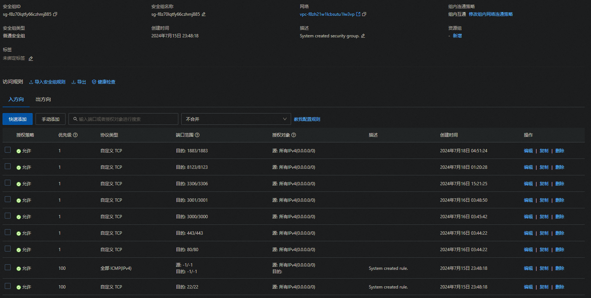

# 配置阿里云服务器  

## 常用命令
``` shell
# 检测端口是否被使用
netstat -apn | grep 1883
```

## 一.配置安全组
开放3000端口  
配置域名
hichchen.top


## 二.配置UBUNTU服务器(20.04)
### 1.切换源服务器
1.查询版本  
```
lsb_release -a  
```
2.备份源文件  
```
sudo cp /etc/apt/sources.list /etc/apt/sources.list.back  
``` 
3.修改源文件(https://mirrors.tuna.tsinghua.edu.cn/help/ubuntu/)  
``` 
vim /etc/apt/sources.list
```
``` shell
deb https://mirrors.tuna.tsinghua.edu.cn/ubuntu/ focal main restricted universe multiverse
# deb-src https://mirrors.tuna.tsinghua.edu.cn/ubuntu/ focal main restricted universe multiverse
deb https://mirrors.tuna.tsinghua.edu.cn/ubuntu/ focal-updates main restricted universe multiverse
# deb-src https://mirrors.tuna.tsinghua.edu.cn/ubuntu/ focal-updates main restricted universe multiverse
deb https://mirrors.tuna.tsinghua.edu.cn/ubuntu/ focal-backports main restricted universe multiverse
# deb-src https://mirrors.tuna.tsinghua.edu.cn/ubuntu/ focal-backports main restricted universe multiverse

# 以下安全更新软件源包含了官方源与镜像站配置，如有需要可自行修改注释切换
deb http://security.ubuntu.com/ubuntu/ focal-security main restricted universe multiverse
# deb-src http://security.ubuntu.com/ubuntu/ focal-security main restricted universe multiverse

# 预发布软件源，不建议启用
# deb https://mirrors.tuna.tsinghua.edu.cn/ubuntu/ focal-proposed main restricted universe multiverse
# # deb-src https://mirrors.tuna.tsinghua.edu.cn/ubuntu/ focal-proposed main restricted universe multiverse
```
4.更新源  
```
sudo apt update  
sudo apt upgrade
```
### 2.配置用户(hich)
```
adduser hich
```

修改用户名权限
```
sudo chmod +w /etc/sudoers
sudo vim /etc/sudoers
``` 

```
hich ALL=(ALL:ALL) ALL
```
```
sudo chmod -w /etc/sudoers
```
### 3.修改文件权限(hich)
```
sudo chmod 777 filename
```

## 三.配置MYSQL
--------------------------------------
### 1.安装mysql
``` shell
sudo apt update
sudo apt install mysql-server
mysql --version

# 配置sqml
sudo mysql

>>use mysql；
>>select user, plugin from mysql.user;  #root用户plugin为auth_socket，之后会出现错误
>>update mysql.user set plugin='mysql_native_password' where user='root';  #修改plugin
>>update user set host = '%' where user = 'root';  #给root用户授权使之可以在任何网络中访问
>>alter user 'root'@'%' IDENTIFIED WITH mysql_native_password BY '1002chEN*';  #修改密码
>>FLUSH PRIVILEGES;  #更新配置
>> exit #退出

service mysql restart  #重启mysql服务

mysql -u root -p

1002chEN*

```
#配置远程连接 解除地址绑定
sudo vim /etc/mysql/mysql.conf.d/mysqld.cnf 
``` shell
#bind-address           = 127.0.0.1
mysqlx-bind-address     = 127.0.0.1
```

### 2.mysql使用
``` shell
# 启动mysql服务
sudo systemctl start mysql
# 停止mysql服务
sudo systemctl stop mysql
# 设置开机自动启动mysql服务
sudo systemctl enable mysql
# 检查mysql服务状态
sudo systemctl status mysql
# 重启mysql服务
sudo service mysql restart
```
### 3.配置mysql
```shell
# 创建数据库
CREATE DATABASE smarthome_flow
# 使用数据库
USE smarthome_flow;
# 创建用户表
CREATE TABLE users (
    id INT AUTO_INCREMENT PRIMARY KEY,
    username VARCHAR(50) NOT NULL,
    password VARCHAR(50) NOT NULL
);

# 创建设备表（由软件自动生成）
CREATE TABLE IF NOT EXISTS devicedata (
    id  INT AUTO_INCREMENT PRIMARY KEY,
    type VARCHAR(50) NOT NULL,
    handle VARCHAR(50) NOT NULL,
    text VARCHAR(50) NOT NULL,
    unit VARCHAR(10) NOT NULL,
    value INT NOT NULL,
);
# 创建设备数据表（由软件自动生成）
CREATE TABLE IF NOT EXISTS %1 (
    id INT AUTO_INCREMENT PRIMARY KEY,
    update_time timestamp not null default CURRENT_TIMESTAMP on update CURRENT_TIMESTAMP
);

# 查询表列表  
SHOW TABLES;
# 插入管理者信息
INSERT INTO users (username, password)
VALUES ('admin', 'admin123456');

# 添加设备数据
INSERT INTO devicedata (type, handle,text,unit,value)
VALUES ('switch','lampButton1','灯1',0,20);

```

--------------------------------------
## 四.配置MQTT服务器
因为微信小程序的安全性要求，我们需要使用ssl安全证书来配置mqtt服务器，同时需要使用域名来访问服务器，需要购买域名ssl证书，并实名备案，这样我们微信小程序才能访问服务器。
### 1.安装eqmx  
``` shell
1.配置 EMQX Apt源
curl -s https://assets.emqx.com/scripts/install-emqx-deb.sh | sudo bash
2. 安装 EMQX
sudo apt-get install emqx
3. 启动 EMQX
sudo systemctl start emqx
4. 启动激活
emqx start
``` 
### 2.配置证书
#### 购买ssl证书
#### 下载pem和key文件
#### 打开emqx的配置网站，默认账号：admin 密码：public
#### 打开管理中的监听器配置sll和wss的tls，最后更新就行了，注意服务器的防火墙要开发emqx需要的端口 1883 8883 8083 8084端口，同时要配置emqx的访问控制，添加访问用户
https://blog.csdn.net/ywt092/article/details/134496250


--------------------------------------
## 五.配置NODEJS服务
## 1.安装nodejs
``` shell
sudo apt update
sudo apt install nodejs npm
node -v
npm -v
``` 
## 2.配置项目
配置视频流服务器
``` shell
npm install ws
npm install fs
npm install http-server
#配置https证书
#复制证书到ssl路径下
#运行
node cameraserver.js
``` 
配置MYSQL服务
``` shell
npm install express
npm install mysql

node appmysql.js
``` 

配置pm2后台运行
``` shell
npm install pm2 -g
pm2 start 项目名
pm2 show 0
pm2 startup systemd
pm2 list
pm2 reload
pm2 delete
```


--------------------------------------
## 五.配置home-Assistant
### 1.安装Docker
``` shell
sudo apt update
sudo apt install apt-transport-https ca-certificates curl software-properties-common gnupg lsb-release
curl -fsSL https://download.docker.com/linux/ubuntu/gpg | sudo gpg --dearmor -o /usr/share/keyrings/docker-archive-keyring.gpg
echo "deb [arch=$(dpkg --print-architecture) signed-by=/usr/share/keyrings/docker-archive-keyring.gpg] https://download.docker.com/linux/ubuntu $(lsb_release -cs) stable" | sudo tee /etc/apt/sources.list.d/docker.list > /dev/null
sudo apt update
sudo apt install docker-ce docker-ce-cli containerd.io docker-compose-plugin
systemctl status docker
```
```shell 
#启动docker
sudo systemctl start docker
#停止docker
sudo systemctl stop docker
```

### 2.切换docker镜像源
``` shell
sudo mkdir -p /etc/docker
sudo tee /etc/docker/daemon.json <<-'EOF'
{
  "registry-mirrors": ["https://zqkmpkk1.mirror.aliyuncs.com"]
}
EOF
sudo systemctl daemon-reload
sudo systemctl restart docker
```

### 2.安装home-Assistant
```shell 
sudo docker pull homeassistant/home-assistants
```

### 3.启动home-Assistant
```shell
docker run -d --name="home-assistants" -v /homeAss:/config -p 8123:8123 homeassistant/home-assistant


 docker ps -a 
 docker stop Id
 docker rm Id
 docker rm -f Id
 docker start Id
sudo systemctl restart docker 

docker exec -it home-assistants /bin/bash

```
### 4.安全组开放8123端口
### 5.访问
**http://47.120.7.163:8123**

## 6.创建账号密码
hich  
1002chEN

## 六.安装1panel（选）
curl -sSL https://resource.fit2cloud.com/1panel/package/quick_start.sh -o quick_start.sh && sudo bash quick_start.sh

http://47.120.7.163:16300/afa8d106c1


## 七.配置微信小程序https服务器  
步骤：1. 申请域名和ssl证书(https://yundunnext.console.aliyun.com/?p=casnext#/certExtend/buy/cn-hangzhou)
      2.下载证书，并上传到服务器
      3.nodejs使用证书
      https://hichchen.top:3001/login
      4.微信小程序开发设置添加服务器域名  

微信小程序开发：https://mp.weixin.qq.com/wxamp/index/index?lang=zh_CN&token=1246640891
参考博客：https://blog.csdn.net/qq_33973359/article/details/105537568     
 sudo apt-get purge nginx nginx-common # 卸载nginx，包括删除配置文件。
